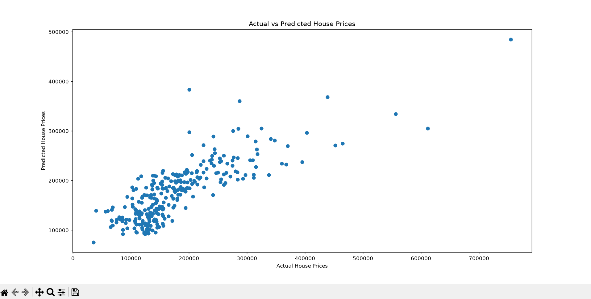

# SCT_ML_1 - House Price Prediction using Linear Regression

## Objective

Implement a Linear Regression model to predict house prices based on square footage, number of bedrooms, and number of bathrooms.

## Dataset

House Prices Dataset

## Technologies Used

* Python
* Pandas
* NumPy
* Scikit-Learn
* Matplotlib

## Features Used

* GrLivArea (Square Footage)
* BedroomAbvGr (Bedrooms)
* FullBath (Bathrooms)

## Model

Linear Regression

## Results

* R² Score: 0.634
* MAE: 35788

## Outcome

Successfully trained a Linear Regression model to predict house prices and visualized Actual vs Predicted prices.
## Output Screenshot

